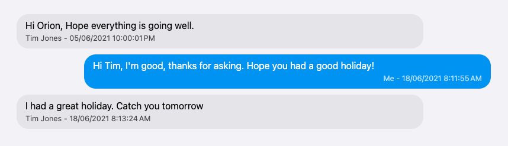

# What does this do?

You give it the Messages and AddressBook databases from an iPhone backup, and it spits out a directory full of HTML files. Each HTML file is one of your chat messages, styled to look somewhat like it would on your phone.

E.g.




# Credit

https://www.richinfante.com/2017/3/16/reverse-engineering-the-ios-backup/ contains a lot of info about the structure and contents of an iPhone backup. I wouldn't have been able to find the database files without it, and it saved me a lot of time not having to work out the tables and relations in the messages database.

# How to use this
I wrote it for myself with no expectation anyone else will use it, but if you want to:

### First, Back up your iPhone to your mac.
This might work on a PC, I didn't try it but theoretically the same files will be in the same places.

On my mac, it ended up in a folder under `~/Library/Application Support/MobileSync/Backup`.
Strong suggestion: Take a **copy** of the folder and work with the copy, lest you break your backup.

### Find the Messages and AddressBook databases
Within the iPhone backup, you need to find two files
- `Library/SMS/sms.db` (`3d0d7e5fb2ce288813306e4d4636395e047a3d28`)
- `Library/AddressBook/AddressBook.sqlitedb` (`31bb7ba8914766d4ba40d6dfb6113c8b614be442` in the backup file structure)

Copy them out to somewhere obvious

### Put the file paths in

Edit `Program.cs` and put the paths in `smsDbPath` and `addressBookDbPath`

### Compile and Run the program

You'll need the .NET SDK (I used .NET 9) and while I used JetBrains rider to build and execute the program a simple `dotnet run` on the command line should suffice.

# Disclaimers

### Why are the times wrong?

I haven't fixed that yet. I think they're stored in UTC in the database and would need to be converted to local time

### Why aren't there any tests? you're a professional developer aren't you?

I wrote this in about one hour in the evening, with the help of ChatGPT. Plus another half hour to write this readme, tidy things up, and make it fit for publishing to GitHub. I know how to write tests and am a big advocate for them in my professional life, but I also have a family and limited time. For a one-shot HTML generator like this they aren't worth it.

### ChatGPT?

I gave it this prompt:

```
I have a sqlite database file of imessage chats, according to this
---
[Here I inserted the description of the Messages table from Rich Infante's article]
---
Please write me a C# application using .NET 8 and whichever is the best SQLite library to extract all the conversations and render them into an HTML file. One HTML file for each conversation.
Include CSS so the messages look like they do on an iPhone
```

It wrote me a program in a rough form, which mostly worked but wasn't in the shape that I wanted. It wrote the HTML/CSS. You can try it yourself!
I rearranged the code and then built the rest upon it. I wrote the addressbook stuff myself, it was easier than trying to explain to the LLM at that point.

I find that LLM's are a great way to really quickly bootstrap small utilities like this where the stakes are low. I don't care _at all_ about the HTML/CSS and I only care a tiny bit about the C# code structure. The app is tiny and I doubt I'll ever have to maintain it or explain to anyone else.

For professional code though, I find they're very poor. When working in codebases with an expected lifetime of 5+ years with a team, I find I pretty much know exactly the code I want to write; it needs to match the patterns in the codebase and be clear, easy to read and maintain, and we'll have to debug it in future. AI doesn't help much there at all. But hey, I'll take the win for this trivial app, it saved me several hours :-)